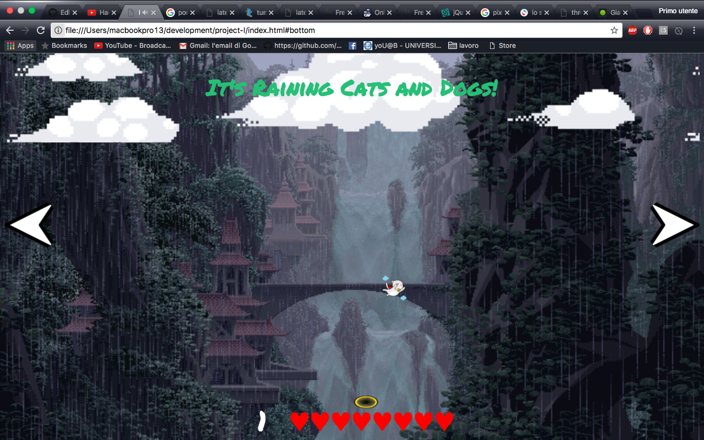

# Project-I: It's raining Cats and Dogs!

A very basic yet addicting game where you have to save from an unavoidable end cats and dogs falling from the sky!

## How to play 

If using non touch devices use your Left and Right arrow keys to move the protal, use the provided arrow buttons if using touch devices. The goal is to catch as many animals as possible before loosing all the 9 lives that you have. Beware! The speed at which the animals fall increases in time.

## How it works

Animals are randomly positioned inside one of the 6 divs at the top of the grid and start falling along that column. 
The portal is positioned by default in the bottom left div and can be moved only across the bottom line of divs. 
If an animal is caught the score goes up by one, on the contrary, if an animal is not caught in time, one life will be popped from the array.
The moment the number of lives is equal to 0, the gameboard will disappear and your score and a button to play again will be displayed.

Sounds are triggered upon:

1. the page loading
2. saving an animal
3. losing an animal
4. every 50 points

## Built With

Built using HTML5, CSS3, and ES6.

## Future Features 

I would like to add a database with all the scores of all the players, replace the two buttons on desktop version with, on the left, a scoreboard with the top scores, and on the right, display the player's personal highscore. 

## Challenges 
The main problem with this project has been CSS, something that I would have never thought could be this hard. Trying to make it responsive has taken a lot longer than what I originally planned and it still is not perfectly responsive.
